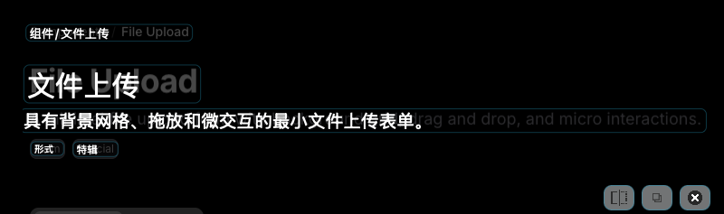
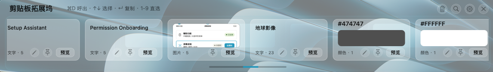
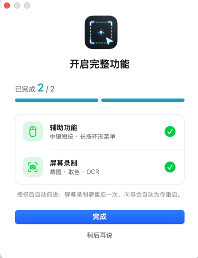
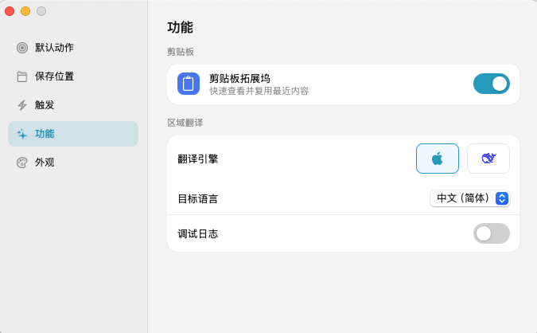
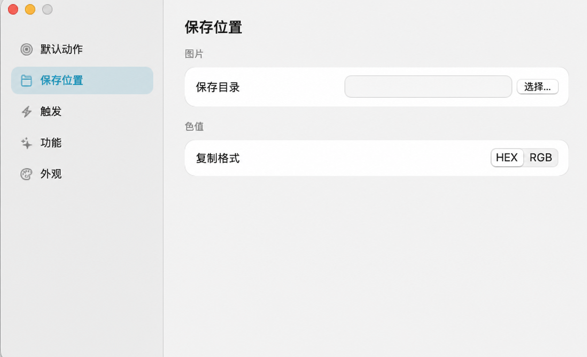

# Intent Capture

轻量原生 macOS 效率工具：**鼠标中键长按弹出环形菜单**，一个手势直达截图、OCR、取色、区域翻译，常驻菜单栏、不打扰。

> A lightweight native macOS capture utility — long-press the mouse middle button to open a radial action menu for screenshot, OCR, color-pick and region-translate.

原作者 / Original author: **[yzsyz11](https://github.com/yzsyz11)** · © 2026

---

## ✨ 特色

- **中键长按环形菜单**——按住中键，动作环绕光标绽放，滑动选中、松手执行；短按直接跑默认动作。这是最顺手的地方，用过就回不去。
- **框选即所得**——截图复制 / 保存 / 保存并复制、区域 OCR 复制文字、屏幕取色复制 HEX·RGB，不开任何笨重编辑器。
- **区域翻译**——框选屏幕任意区域，原地浮层给出译文（DeepSeek 在线 / Apple 原生，macOS 15+）。
- **剪贴板拓展坞**——历史预览、编辑、固定、批量删除、搜索与键盘导航。
- **权限引导向导**——首启/升级自动引导开通权限，一键修复，省心。
- **常驻菜单栏 + 全局快捷键 + 自定义主题色**。

## 📸 截图

| 中键长按 · 环形动作菜单 | 原位置区域翻译 |
|---|---|
|  |  |

| 剪贴板拓展坞（文本 / 图片 / 色值） | 权限引导向导 |
|---|---|
|  |  |

| 功能与翻译引擎设置 | 保存位置与色值格式 |
|---|---|
|  |  |

## 🚀 快速上手

1. 从 [Releases](https://github.com/yzsyz11/intent-capture-mac/releases) 下载 `IntentCapture-mac-arm64.dmg`，拖 `IntentCapture.app` 进「应用程序」。
2. 首次打开按下面「首次打开」一节绕过 Gatekeeper。
3. 打开后按向导开通两项权限（辅助功能 + 屏幕录制）。
4. **按住鼠标中键**试试——环形菜单会绽放，滑到想要的动作松手即可；**短按中键**直接执行默认动作。

## 🔓 首次打开（重要）

本应用为自签、未经 Apple 公证，首次打开会被 Gatekeeper 拦下。二选一：

- **右键打开**：在「应用程序」里右键（Control 点按）`IntentCapture.app` → 打开 → 再点「打开」。
- 若提示「已损坏 / 无法验证」，在「终端」执行一次即可：

  ```bash
  xattr -dr com.apple.quarantine /Applications/IntentCapture.app
  ```

之后正常双击打开。

## 🔐 权限

| 权限 | 用途 | 位置 |
|---|---|---|
| 辅助功能 | 鼠标中键全局监听 | 系统设置 → 隐私与安全性 → 辅助功能 |
| 屏幕录制 | 截图 / 取色 / OCR | 系统设置 → 隐私与安全性 → 屏幕录制 |

App 内「权限设置向导」会带你走完，屏幕录制授权后需重启一次 App 生效。

## 💻 环境要求

- Apple Silicon Mac
- macOS 13 或更高

## 🛠 从源码构建（可选）

```bash
xcode-select --install            # 一次性：命令行工具
bash scripts/verify-macos.sh      # 仅类型检查
bash scripts/package-macos.sh     # 构建 .app 与 .dmg → release/
```

跨版本保留系统权限依赖稳定签名身份，先运行一次：

```bash
bash scripts/create-signing-identity.sh
```

## 📄 许可与署名

基于 [MIT 许可](LICENSE) 开源：**你可以自由使用、修改、再分发，但必须保留原作者 yzsyz11 的版权署名。** 抹去署名或冒充原作者属于违反许可。

原作者：[yzsyz11](https://github.com/yzsyz11)　·　欢迎 star、fork、提 issue。
